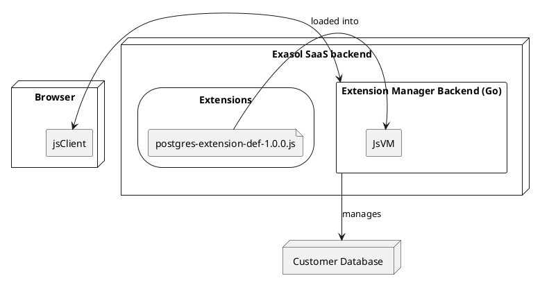
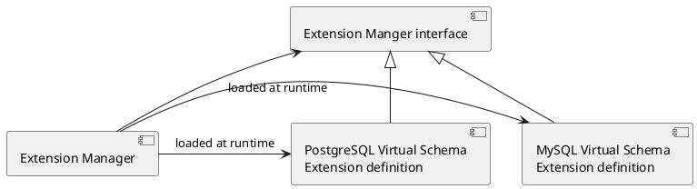
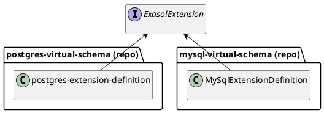
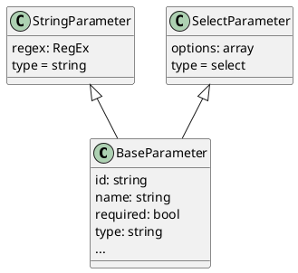
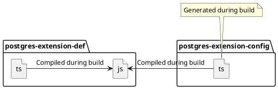
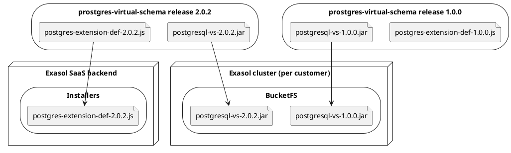
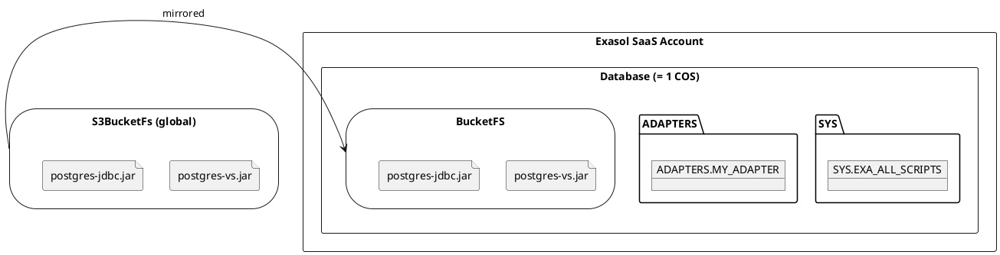
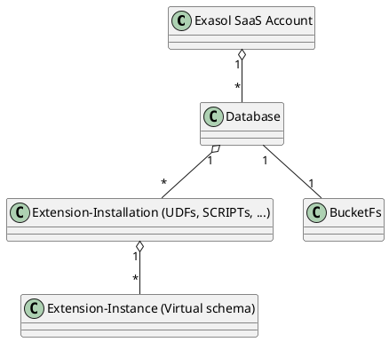
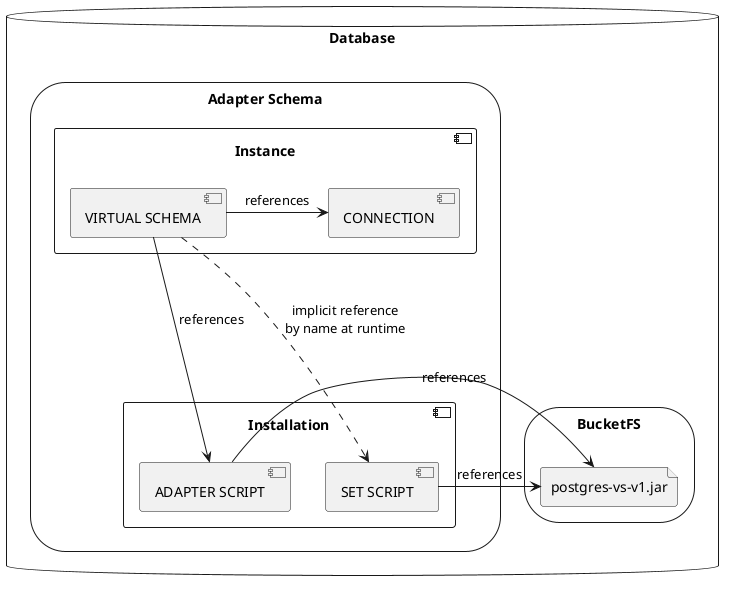

# Design -- Extension Manager

<!--
INFO: This file contains embedded plantuml diagrams. For displaying them you need to enable editor support.
IntelliJ: https://youtrack.jetbrains.com/api/files/74-1236265?sign=MTY1MDg0NDgwMDAwMHwxMS0xfDc0LTEyMzYyNjV8d2VXdWNFVkJfVWZQeV9ZX3JHNF9rYno4cFV2%0D%0AMy1BV2ZSNjZaOUxhdVBOSQ0K%0D%0A&updated=1639999300525
Visual Studio Code: https://marketplace.visualstudio.com/items?itemName=jebbs.plantuml (see https://github.com/qjebbs/vscode-plantuml/issues/449 for fixing Markdown preview)
-->

## Acknowledgments

This document's section structure is derived from the "[arc42](https://arc42.org/)" architectural template by Dr. Gernot Starke, Dr. Peter Hruschka.

## Constraints

This section introduces technical system constraints.

## Solution Strategy

### Requirement Overview

Please refer to the [System Requirement Specification](system_requirements.md) for user-level requirements.

## Building Blocks

### Overall Architecture

The extension installer is split into a backend (running in the Exasol SaaS backend, see [design decisions](#does-em-need-a-backend)) and a client (running in the SaaS UI).



#### EM Provides a REST Interface
`dsn~rest-interface~1`

EM provides a REST interface to clients.

Covers:
* [`req~rest-interface~1`](system_requirements.md#em-provides-a-rest-interface)

Needs: impl, itest

#### EM Implemented as a Go Library
`dsn~go-library~1`

EM is implemented as a Go library instead of an executable Go program.

Rationale:

This allows embedding EM in other applications like SaaS, so it can be reused in different contexts

Comment:
 
Nevertheless EM additionally contains an executable Go program which is useful for testing EM and extensions.

Covers:
* [`req~embeddable-rest-interface~1`](system_requirements.md#rest-interface-is-embeddable)
* [`const~works-with-saas~1`](system_requirements.md#em-works-with-exasol-saas)

Needs: impl

#### EM Generates an OpenAPI Specification
`dsn~openapi-spec~1`

EM generates an OpenAPI specification at runtime using the [Nightapes/go-rest](https://github.com/Nightapes/go-rest) library.

The standalone executable of EM provides the OpenAPI specification as a web page and in JSON format. Applications that embed EM as a library need to create their own endpoint for that.

Covers:
* [`req~openapi-spec~1`](system_requirements.md#em-provides-an-openapi-specification)
 
Needs: impl, itest

#### Extension Registry
`dsn~extension-registry~1`

EM uses a web service called Extension Registry (similar to service discovery) to find available extensions and their JavaScript definitions.

Rationale:

This will allow updating extension definitions without modifying the deployed EM. In the future this will also allow multiple instances of EM to use the same list of available extensions. During development and for integration tests it is easier to use a local directory with JavaScript files for finding available extensions. That's why EM supports both variants. At startup it will check if the configured extension registry URL starts with `http` and will use the appropriate implementation.

Covers:
* [`req~finding-available-extensions~1`](system_requirements.md#em-finds-available-extensions)

Needs: impl, utest, itest

### Extensions

The Extension Manager has an extension mechanism.

The extensions are integration projects maintained by Exasol. For now, it's not possible to install third party extensions, since it would be a security risk.

The extension manager itself has no dependencies to the Virtual Schema projects. They are loaded at runtime.



#### Components of an Extension
`dsn~extension-components~1`

An extension might consist of JDBC driver, artifacts, configuration and database objects. Depending on it's nature a specific extension might not require all artifacts.

In the initial version when managing extensions EM requires the following components to be available in BucketFS and does not actively manage them:
* JDBC driver
* Artifacts in BucketFS, e.g. jar files
* 3rd party libraries

Instead, for managing extensions EM only considers the following database objects:
* `ADAPTER SCRIPT`
* `SET SCRIPT`
* `CONNECTION`
* `VIRTUAL SCHEMA` including mapping

Note: In the following cases a separate artifact in BucketFS is not required, as extension definition can inline these contents into the SQL statements of either adapter script or set script:
* JSON content of virtual schema EDML mapping, see [EDML user guide](https://github.com/exasol/virtual-schema-common-document/blob/main/doc/user_guide/edml_user_guide.md)
* Lua scripts

When creating the required database objects EM will read all required arguments, configurations and credentials from the [extension definition](#extension-definitions). The extension definition can also define [parameters](#parameters-for-extension-configuration). EM will evaluate the parameter definitions and then ask the user to enter a value for each of the parameters. See also an example of the [installation process](#installation-process).

Covers:

* [`req~extension~1`](system_requirements.md#install-required-artifacts)
* [`req~install-extension-artifacts~1`](system_requirements.md#install-database-objects)

Needs: impl, utest

#### Configurable BucketFS Path
`dsn~configure-bucketfs-path~1`

EM allows configuring the BucketFS path where extensions artifacts like JAR files are located.

Rationale:

As described in [`dsn~extension-components~1`](#components-of-an-extension) an extension may require files in BucketFS. The path to the BucketFS location depends on the Exasol database deployment.

Needs: impl, utest, itest

### Extension Definitions
`dsn~extension-definition~1`

Each extension might be implemented in an arbitrary programming language and typically are based on a so-called [user defined function](system_requirements.md#terms-and-abbreviations). In order to allow EM to manage multiple heterogenous extensions in a unique way, each extension is represented by small wrapper implementing a uniform interface. This wrapper is called an "extension definition".

The interface is defined in [`extension-manager-interface`](https://github.com/exasol/extension-manager-interface/):



Covers:

* [`req~extension~1`](system_requirements.md#install-required-artifacts)

Needs: impl, utest, itest

#### Storage for Extension Definitions
`dsn~extension-definitions-storage~1`

The extension definitions are placed in a storage that is accessible from the extension-manager backend. Access from inside the database is not required.

Covers:
* [`req~install-extension-artifacts~1`](system_requirements.md#install-database-objects)
* [`req~define-configuration-parameters~1`](system_requirements.md#parameter-types)
* [`req~uninstall-extension~1`](system_requirements.md#uninstalling-extensions)

Needs: impl, itest

#### Extension Compatibility
`dsn~extension-compatibility~1`

EM verifies that a loaded extension uses an extension API versions with the same major version as EM.

Covers:
* [`req~extension-compatibility~1`](system_requirements.md#extension-compatibility)

Needs: impl, utest, itest

#### Versioning
`dsn~versioning~1`

Note that only the latest version of the extension definition is deployed.

That does not mean that it's impossible to install older versions of an extension. Just the extension definition (the plugin for the extension manager) is always the latest version.

That means that the extension definition must be able to uninstall and update all old versions of its extension. That makes testing harder but is the only way to have the upgrade path tested.

The alternative to also version the extension definition would lead to unmaintained and untested code, since the old version would not be tested with newer DB versions.

This requirement must be covered by extensions.

Covers:
* [`req~install-extension-artifacts~1`](system_requirements.md#install-database-objects)
* [`req~uninstall-extension~1`](system_requirements.md#uninstall-an-extension)

### Parameters for Extension Configuration
`dsn~configuration-parameters~1`

The extension definition also includes parameters for configuring the extension.

Covers:
* [`req~define-configuration-parameters~1`](system_requirements.md#parameter-types)

Needs: impl, utest

#### Parameter Definition Format
`dsn~parameter-definitions~1`

EM extension interface uses a flexible JSON structure to describe the parameters including [conditional parameters](#conditional-parameters).

Rationale: Individual extensions might have different parameters. For example a virtual schema for another database might support multiple connection protocols or libraries (e.g. ODBC and JDBC) that require different configuration options. Depending on the selected protocol EM can then show only the parameters for the selected protocol but hide unrelated parameters.

Example:

```js
extension = {
  // ...
  condition: {
    parameter: "connectorType",
    operator: Operators.EQ,
    value: "jdbc"
  }
  // ...
}
```

While this requires interpretation of the JSON structure, it allows to transfer the parameter definition to the frontend as simple JSON in contrast to the alternative options considered.

Covers:
* [`req~define-configuration-parameters~1`](system_requirements.md#parameter-types)
* [`req~parameter-types~1`](system_requirements.md#validation-of-parameter-values)

Needs: impl, utest, itest

#### Parameter Types
`dsn~parameter-types~1`

Each extension can define parameter definitions. The UI then shows a form with these parameters to the users and passes the values to the `createInstance` endpoint.

The following class hierarchy is used to model parameter definitions:



Covers:
* [`req~parameter-types~1`](system_requirements.md#validation-of-parameter-values)

Needs: impl, utest

#### Conditional Parameters
`dsn~conditional-parameters~1`
Status: draft

Conditions for conditional parameters are represented by JSON structures, see [design decision](#alternative-options-to-represent-conditional-parameters) against alternative options to represent conditional parameters.

Covers:
* [`req~parameter-types~1`](system_requirements.md#validation-of-parameter-values)

#### Parameters, Versions and Updates
`dsn~parameter-versioning~1`

Each parameter definition is attached to a specific version of the extension.

Rationale: Parameters can change over time, see [Updates](#updates).

Covers:
* [`req~define-configuration-parameters~1`](system_requirements.md#parameter-types)
* [`req~upgrade-extension~1`](system_requirements.md#uninstalling-extensions)

Needs: impl, utest

### Parameter Validation

#### Reuse Parameter Validation Rules
`dsn~reuse-parameter-validation-rules~1`

Parameter validation for both stages (frontend and backend) is configured in [extension definition](#extension-definitions), see related [Design Decision](#typescript-library-for-parameter-validation).

Covers:
* [`req~validate-parameter-values~1`](system_requirements.md#ui-languages)

Needs: impl, utest

#### Simple Parameter Validation Rules
`dsn~parameter-validation-rules-simple~1`

The extension definition can specify rules for parameter validation:

```ts
param = {
  id: "port",
  name: "Port",
  type: "string",
  regex: /\d+/ // <-- Validation via regex
}
```

Covers:
* [`req~validate-parameter-values~1`](system_requirements.md#ui-languages)

Needs: impl, utest

#### Complex Parameter Validation Rules
`dsn~parameter-validation-rules-complex~1`
Status: draft

More complex validations involving multiple parameters can be defined via a JavaScript callback function that is executed only in the backend, not the frontend. That gives the extension definition the maximum flexibility while simplifying the validation in the frontend.

```ts
extension = {
  //...
  validate(parameterValues) {
    if (parameterValues["connectorType"] === "jdbc" && !isValidJdbcParameter(parameterValues["additionalJdbcParameter"])) {
      return "Invalid value for additionalJdbcParameter.";
    }
  }
}
```

See design decision [against a callback for the client side validation](#callback-for-client-side-validation).

Covers:
* [`req~validate-parameter-values~1`](system_requirements.md#ui-languages)

## Runtime

### Listing Extensions
`dsn~list-extensions~1`

EM builds the list of extensions based on the extension definitions. EM shows only extensions for which all components are available, e.g. required artifacts in BucketFS. The list also shows details about each  extension:
* status: available or installed
* version

Covers:
* [`feat~list-extensions~1`](system_requirements.md#install-extensions)

Needs: impl, utest, itest


### Deploy Extension Definitions
`dsn~extension-definitions-deployment~1`

During the build of each virtual-schema project the extension definitions (written in TypeScript) are compiled to a single JavaScript file:



The built installers are attached to the release:

Release assets:
```
postgresql-vs-2.0.2.jar
postgresql-vs-2.0.2.jar.sha256
postgres-extension-def-2.0.2.js
postgres-extension-def-2.0.2.js.sha256
```

A crawler collects the JARs and extension definitions and copies them to BucketFS at scheduled interval.

**This crawler is at the moment not part of this project.**



Covers:
* [`req~install-extension-database-objects~1`](system_requirements.md#update-extension)
* [`req~define-configuration-parameters~1`](system_requirements.md#parameter-types)
* [`req~uninstall-extension~1`](system_requirements.md#uninstalling-extensions)

### Configure an Extension

#### Validate Parameters
`dsn~validate-parameters~1`

EM validates parameters in two stages:

* In the client: Simple validation of each parameter
  * Required fields also with conditions
  * For text: regular expressions
  * For numbers: min, max
* In the backend:
  * Everything validated in the frontend (validate again to prevent attacks)
  * Validation of the whole input: Here EM can validate more complex constraints (for example multiple interdependent fields)

Covers:
* [`req~validate-parameter-values~1`](system_requirements.md#ui-languages)

Needs: impl, utest, itest

### Install an Extension

#### Installation Scope
`dsn~installation-scope~1`

The installation of an extension is scoped to an *Exasol database* (new term in SaaS context).





Covers:
* [`req~install-extension-database-objects~1`](system_requirements.md#update-extension)


#### Installation Metadata
`dsn~installation~metadata~1`

Extensions don't store their own metadata. Instead they read information about existing adapter scripts, connection definitions and virtual schemas from the Exasol database itself. In most cases this is implemented by querying Exasol's metadata tables.

However, for example for reading back the credentials stored in a connection, EM uses a temporary UDF that reads back the secret value.

Covers:
* [`req~install-extension-database-objects~1`](system_requirements.md#update-extension)

Needs: impl, utest, itest

#### Installation Process
`dsn~installation~process~1`

The following list describes the installation process using the extension for a **virtual schema** as example.

* Check if the version of the `extension-manager-interface` implemented by the extension is supported.
* Check if required files exist in BucketFs with the expected version and file size.
  * If not all files are available, then EM aborts the installation.
* Check if an `ADAPTER SCRIPT` exists for the required VS Jar.
  * Use the existing script and the schema it is located in.
  * If no script exists: create a new schema and create a new adapter script.
* Check if a `SET SCRIPT` with name `IMPORT_FROM_<vs-name>` exists using the expected file.
  * Create one if necessary
  * Fail if it exists with the wrong file version and another virtual schema is installed.
* Create or update an existing `CONNECTION` with the parameters entered by the user.
* Create or update an existing `VIRTUAL SCHEMA` with the parameters entered by the user.

Deployment view of an installed virtual schema:



Covers:
* [`req~install-extension-database-objects~1`](system_requirements.md#update-extension)

Needs: impl, utest, itest

#### Upgrades
`dsn~upgrade-extension~1`

EM can upgrade an installed extensions and its instances to the latest version.

Covers:
* [`req~upgrade-extension~1`](system_requirements.md#uninstalling-extensions)
* [`req~install-extension-database-objects~1`](system_requirements.md#update-extension)

Needs: impl, utest, itest

### Extension Context

The extension context allows extension definitions to interact with the extension manager and the database (e.g. by executing queries).

#### Extension Context SQL Client
`dsn~extension-context-sql-client~1`

The SQL client in the extension context allows the extension definition to execute statements and run queries against the database and process query results.

Rationale:

* This allows the extension to create necessary database objects like `SCRIPT`s, `CONNECTION`s and `VIRTUAL SCHEMA`s.
* The extension can also run arbitrary queries in order to read required information about their installations (e.g. scripts) and instances (e.g. virtual schemas).
* While EM also provides [access to metadata](#extension-context-metadata) via the context, this information may not be sufficient. Executing arbitrary queries ensures maximum flexibility for extensions.

Covers:
* [`req~install-extension-database-objects~1`](system_requirements.md#update-extension)

Needs: impl, utest, itest

#### Extension Context BucketFS
`dsn~extension-context-bucketfs~1`

The BucketFS client in the extension context allows the extension definition to interact with BucketFS.

Covers:
* [`req~install-extension-database-objects~1`](system_requirements.md#update-extension)

Needs: impl, utest, itest

##### Resolving Files in BucketFS
`dsn~resolving-files-in-bucketfs~1`

EM resolves filenames to absolute paths in BucketFS.

Rationale:

Extensions require files in BucketFS. The exact location in BucketFS of the files is not known when creating an extension, only the file name (e.g. `document-files-virtual-schema-dist-7.3.3-s3-2.6.2.jar`). In order to create adapter scripts, the extension must know the absolute path of the file in BucketFS (e.g. `/buckets/bfsdefault/default/document-files-virtual-schema-dist-7.3.3-s3-2.6.2.jar`). So EM must allow the extension to resolve file names to an absolute path in BucketFS.

Needs: impl, utest, itest

#### Extension Context Metadata
`dsn~extension-context-metadata~1`

The Metadata client in the extension context allows the extension definition to read Metadata (e.g. tables `SYS.EXA_ALL_SCRIPTS` or `SYS.EXA_ALL_VIRTUAL_SCHEMAS`) from the database.

Rationale:

* This information is necessary for the extension to find its installations (e.g. scripts) and instances (e.g. virtual schemas).
* As an alternative extensions could also use the [SQL client](#extension-context-sql-client) included in the context, but this would require duplicating SQL queries across many extensions.
* The schema for metadata table `SYS.EXA_ALL_VIRTUAL_SCHEMAS` has changed between Exasol v7 and v8. So the code for reading this table requires distinction between the two versions.
  * Moving this code to the extensions would cause even more code duplication that is hard to maintain.
  * **Note:** EM will only need to work with Exasol v8, so support for v7 is actually not necessary. However the Docker container for v8 currently does not support running Python and Java UDFs. Until this is fixed we still need v7 for integration testing.

Covers:
* [`req~install-extension-database-objects~1`](system_requirements.md#update-extension)

Needs: impl, utest, itest

## Cross-cutting Concerns

## Design Decisions

### JDBC driver

Most virtual schemas (including for example the postgres virtual schema) require an additional third-party JDBC driver. That driver for now must be copied manually into the BucketFS of all SaaS offerings, see [Components of an Extension](#components-of-an-extension).

### JAR Files

Most virtual schemas (including for example the postgres virtual schema) are implemented as a jar file in BucketFS.  The jar file for now must be copied manually into the BucketFS of all SaaS offerings, see [Components of an Extension](#components-of-an-extension).

### Does EM need a Backend?

One option would have been to implement everything in the JavaScript client. However, the developers discarded that option, since it does not allow us to upgrade the installed adapters automatically. An automated job can't run in a browser.

#### Execution of JavaScript at Runtime

The compiled JavaScript code is evaluated in the backend using a nested JavaScript interpreter.

By that it is isolated and can't access resources like disk or network.

### TypeScript Library for Parameter Validation

The developers decided to implement parameter validation as a TypeScript library [`extension-parameter-validator`](https://github.com/exasol/extension-parameter-validator).

Rationale: By this a single implementation can be used for both validation stages: frontend and backend. The Go backend will use a JavaScript VM.

### Callback For Client Side Validation

We decided against a callback for the client side [validation of parameters](#parameter-validation). The main reason was that it would require to load code into the client at runtime. That would require to run `eval()` on code retrieved from a request. Even so the security risk of that seems acceptable, we decided against it since it would look suspicious.

### Alternative Options to Represent Conditional Parameters

The developers considered the following options:

* Condition as JavaScript code in a string, e.g.

  `condition: "parameters.connectorType === \"jdbc\""`

* Condition as JavaScript callback, e.g.

   ```js
  extension = {
    condition: (parameterValues) => parameterValues.connectorType === "jdbc"
  }
  ```

While both options don't need any interpretation logic they would require executing the JavaScript snippet in the frontend with `eval()` which poses a security risk.

Interpretation of the JSON structure was implemented in a separate library `extension-parameter-validator` written in TypeScript which is used by both the frontend and the backend. By this additional implementation effort need to be invested only once.

### Programming language

The developers decided to implement extension definitions in TypeScript.

#### Alternative JSON

The developers decided for a programming language like JS since some extensions have more complex installation mechanisms. Expressing this by just providing SQL scripts with placeholders quickly reaches its limit.

Especially the function for reading back parameter values can get a bit more complex.

#### Alternative Lua

We could also use Lua. The developers decided for JS since:

* JS it more popular --> more developers know it
* JS is used in the frontend. If at some point we change our decision and want to run the installation in the client, we don't need to update the installers.

#### Alternative JavaScript

JavaScript does not provide type checking of the interface, hence not all potential incompatibilities with the Extension API can be found at compile time.

TypeScript is compiled to JavaScript, so no additional tooling is required at runtime.

TypeScript adds a bit of complexity at build time for transpiling TypeScript to JavaScript, but the developers decided to accept this additional effort.

## Quality Scenarios

## Risks
