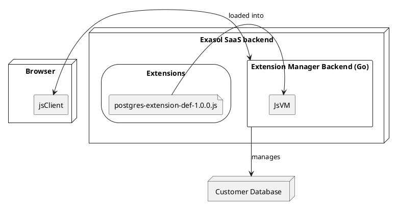
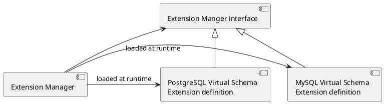
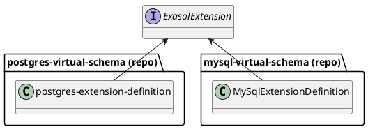
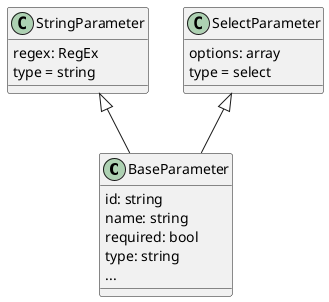
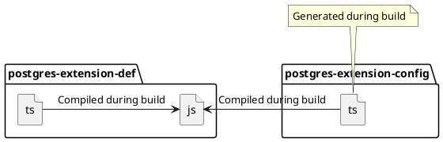
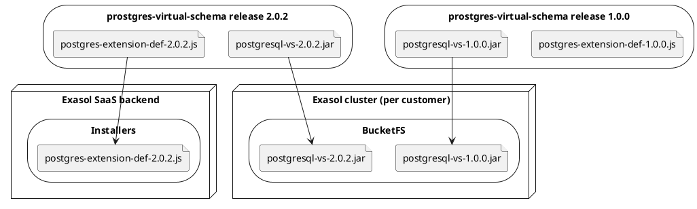
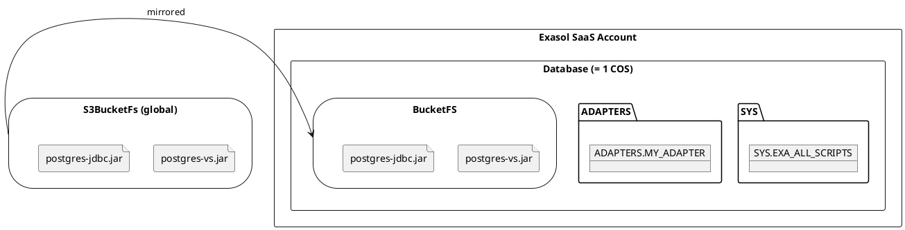
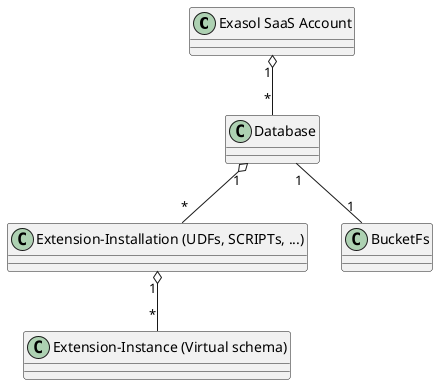
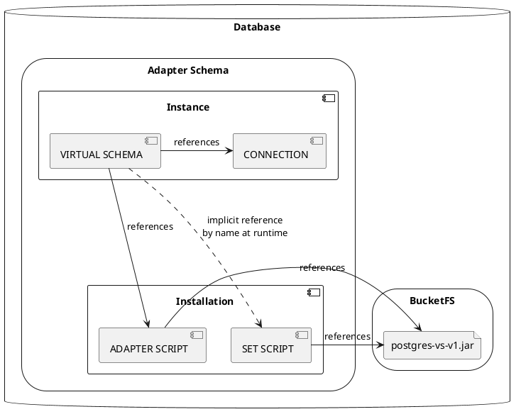

# Design

<!--
INFO: This file contains embedded plantuml diagrams. For displaying them you need to enable editor support.
IntelliJ: https://youtrack.jetbrains.com/api/files/74-1236265?sign=MTY1MDg0NDgwMDAwMHwxMS0xfDc0LTEyMzYyNjV8d2VXdWNFVkJfVWZQeV9ZX3JHNF9rYno4cFV2%0D%0AMy1BV2ZSNjZaOUxhdVBOSQ0K%0D%0A&updated=1639999300525
Visual Studio Code: https://marketplace.visualstudio.com/items?itemName=jebbs.plantuml (see https://github.com/qjebbs/vscode-plantuml/issues/449 for fixing Markdown preview)
-->

## Overall Architecture

The extension installer is split into a backend (running in the Exasol SaaS backend) and a client (running in the SaaS UI).



### Do we Need a Backend?

One option would be to implement everything in the JS client. However, we discarded that option, since it does not allow us to upgrade the installed adapters automatically. An automated job can't run in a browser.

### Extensions

The extension manager has an extension mechanism.

The extensions are integration projects maintained by Exasol. For now, it's not possible to install third party extensions, since it would be a security risk.

The extension manager itself has no dependencies to the Virtual Schema projects.
They are loaded at runtime.



## Extension API

We have one extension definition per extension (integration project).

All extension definitions implement the same public interface defined in [`extension-manager-interface`](https://github.com/exasol/extension-manager-interface/):



### Language

We decided to implement extensions in TypeScript.

#### Alternative JSON

We decided for a programming language like JS since some extensions have more complex installation mechanisms. Expressing this by just providing SQL scripts with placeholders quickly reaches its limit.

Especially the function for reading back parameter values can get a bit more complex.

#### Alternative Lua

We could also use Lua. We decided for JS since:

* JS it more popular --> more developers know it
* JS is used in the frontend. If at some point we change our decision and want to run the installation in the client, we don't need to update the installers.

#### Alternative JavaScript

JavaScript does not provide type checking of the interface. We can find all incompatibilities with the Extension API at compile time.

TypeScript is compiled to JavaScript, so no additional tooling is required at runtime.

TypeScript adds a bit of complexity at build time for transpiling TypeScript to JavaScript, but we accept this additional effort.

#### Execution of JavaScript at Runtime

The compiled JavaScript code is evaluated in the backend using a nested JavaScript interpreter.

By that it is isolated and can't access resources like disk or network.

### Parameters

#### Different Parameter Types

Each adapter can define parameter definitions. The UI then shows a form with these parameters to the users and passes the values to the `createInstance` endpoint.

We modeled the parameter definitions using the following class hierarchy:



#### Parameter Validation

The parameters are validated in the frontend and in the backend:
* validation in the frontend is required for a good user experience
* validation in the backend is required for security to avoid bypassing the UI.

Since we're lazy we decided to use the same code for both validations.

For that reason we write the validation in TypeScript library [`extension-parameter-validator`](https://github.com/exasol/extension-parameter-validator) and use it in the frontend and in a JavaScript VM in the Go backend.

#### Parameters, Versions and Updates

We decided to attach the parameter definitions to a specific version of the extension. That is required since parameters can change over time.

That implies that when doing updates, the extension-manager must check if parameter definitions changed. If there were breaking changes, the update can't be performed automatically.

The only option would be to add update scripts that define how to convert the parameters from one version to another. However, that is currently out of scope.

#### Conditional Parameters

We need to have conditional parameters. An example use case for this is when a virtual schema for another database supports multiple connection protocols or libraries (e.g. ODBC and JDBC) that require different configuration options. Depending on the selected protocol we want to show or hide some parameters.

We decided to represent the condition as a JSON structure.

Example:

```js
extension = {
  // ...
  condition: {
    parameter: "connectorType",
    operator: Operators.EQ,
    value: "jdbc"
  }
  // ...
}
```

While this requires interpretation of the JSON structure, it allows us to transfer the parameter definition to the frontend as simple JSON in contrast to the alternative options considered.

##### Alternative Options

We considered the following options:

* Condition as JavaScript code in a string

  Example: `condition: "parameters.connectorType === \"jdbc\""`

* Condition as JavaScript callback

  Example:
   ```js
  extension = {
    condition: (parameterValues) => parameterValues.connectorType === "jdbc"
  }
  ```

While both options don't need any interpretation logic they would require executing the JavaScript snippet in the frontend with `eval()` which could be interpreted as a security issue.

The additional effort for interpreting the JSON structure occurs only once as we implement the interpretation in a separate library `extension-parameter-validator` written in TypeScript which is used by both the frontend and the backend.

#### Validation

We implement input validation in two stages:

* In the client: Simple validation of each field
  * Required fields also with conditions
  * For text: regular expressions
  * For numbers: min, max
* In the backend:
  * Everything validated in the frontend (validate again to prevent attacks)
  * Validation of the whole input: Here we can validate more complex constraints that for example involve multiple fields

For the validation done by the frontend we define the constraints declarative in the extension:

```ts
param = {
  id: "port",
  name: "Port",
  type: "string",
  regex: /\d+/ // <-- Validation via regex
}
```

In case complex validation involving multiple parameters is required, we we define it via a JavaScript callback function that is executed only in the backend, not the frontend. That gives the extension definition the maximum flexibility while simplifying the validation in the frontend.

```ts
extension = {
  //...
  validate(parameterValues) {
    if (parameterValues["connectorType"] === "jdbc" && !isValidJdbcParameter(parameterValues["additionalJdbcParameter"])) {
      return "Invalid value for additionalJdbcParameter.";
    }
  }
}
```

We decided against a callback for the client side validation. The main reason was that it would require to load code
into the client at runtime. That would require to run `eval()` on code retrieved from a request. Even so the security
risk of that seems acceptable, we decided against it since it would look suspicious.

### UI Languages

The current SaaS implementation only supports English as language in the user interface. That's why we decided to omit translating UI texts to avoid complexity. In case other languages are required we will adapt the extension interface.

## Deployment of the Extension Definitions

During the build of each virtual-schema project the extension definitions (written in TypeScript) are compiled to a
single JavaScript file:



The built installers are attached to the release:

Release assets:
```
postgresql-vs-2.0.2.jar
postgresql-vs-2.0.2.jar.sha256
postgres-extension-def-2.0.2.js
postgres-extension-def-2.0.2.js.sha256
```

A crawler collects the JARs and extension definitions and copies them to BucketFS at scheduled interval.

This crawler is at the moment not part of this project.



### Versioning

Note that only the latest version of the extension definition is deployed.

That does not mean that it's impossible to install older versions of an extension. Just the extension definition (the plugin for the extension manager) is always the latest version.

That means that the extension definition must be able to uninstall and update all old versions of its extension. That makes testing harder but is the only way to have the upgrade path tested.

The alternative to also version the extension definition would lead to unmaintained and untested code, since the old version would not be tested with newer DB versions.

The extension definitions are placed in a storage that's accessible from the extension-manager backend. Access from inside the database is not required.

Most virtual schemas (including for example the postgres virtual schema) require an additional third-party JDBC driver. That driver for now must be copied manually into the BucketFS of all SaaS offerings.

## Installation Scope

The installation of an extension is scoped to an *Exasol database* (new term in SaaS context).





## Installation and Metadata

Extensions don't store their own metadata. Instead they read information about existing adapter scripts, connection definitions and virtual schemas from the Exasol database itself. In most cases this is implemented by querying Exasol's metadata tables.

However, for example for reading back the credentials stored in a connection, we use a temporary UDF that reads back the secret value.

### Installation Process of a Document Virtual Schema

This is an example process how a document virtual schema is installed.

* Check if the version of the `extension-manager-interface` implemented by the extension is supported.
* Check if required files exist in BucketFs with the expected version and file size.
  * If not all files are available, the installation fails.
* Check if an `ADAPTER SCRIPT` exists for the required VS Jar.
  * Use the existing script and the schema it is located in.
  * If no script exists: create a new schema and create a new script.
* Check if a `SET SCRIPT` with name `IMPORT_FROM_<vs-name>` exists using the expected file.
  * Create one if necessary
  * Fail if it exists with the wrong file version and another virtual schema is installed.
* Create or update an existing `CONNECTION` with the parameters entered by the user.
* Create or update an existing `VIRTUAL SCHEMA` with the parameters entered by the user.

Deployment view of an installed virtual schema:



## Testing

The different components of the project are responsible for testing different things.

### extension-manager

The extension-manager project contains unit and integration tests that verify
* Loading and executing of JavaScript extensions
* Database interactions
* REST API interface
* Server-side parameter validation using `extension-parameter-validator`
* ...

Tests use dummy extensions, no real extensions.

### Extensions

Extensions are located in the repositories of the virtual schema implementations, e.g. `s3-document-files-virtual-schema`.

Tests for extensions are:
* Verify correct implementation of a specific version of the `extension-manager-interface` using the TypeScript compiler
* Unit tests written in TypeScript verify all execution paths of the extension
* Integration tests written in Java use a specific version of the `extension-manager` to verify that the extension
  * can be loaded
  * can install a virtual schema and check that it works
  * can update parameters of an existing virtual schema
  * can upgrade a virtual schema created with an older version
  * ...

## Restrictions

### Document Virtual Schemas Only Support a Single Version

Document virtual schemas like `s3-document-files-virtual-schema` require a `SET SCRIPT` that must have a specific name. As this script references a specific virtual schema Jar, it's not possible to install multiple version of the same virtual schema in the same database `SCHEMA`.

This means that in order to test a new version of a virtual schema we have to create a new `SCHEMA` with the required database objects.

## Possible Future Changes

The following features are out of scope for now, but the architecture of the extension manager must be prepared to support them.

### On Premise Support

The extension manager is also useful for customer using Exasol on premise.

### Automatic Installation of Required Files

Currently the extension manager expects that requires files like virtual schema JARs or JDBC drivers are already available in BucketFS. A future version might download and install these files automatically or update them to the latest version.

### Automatic Updates of Installed Extensions

When new versions of a virtual schema become available that potentially fix security issues, it would be helpful to automatically install the new version and update the virtual schemas during a maintenance window.

### Install Older Versions

If an older version of the VS Jar is available on BucketFS we could allow the user to choose the version they want to use.

Currently the extension manager will always use the Jar matching the extension's version.

### Use Custom Adapter Scripts

In case the user wants to use an existing `ADAPTER SCRIPT` or explicitly wants to create a new one, the extension manager allows them to choose between these options.

### Usage via a Automation Tools

Currently the extension manager is only meant to be used by the SaaS UI. In the future we might allow using the extension manager also via automation tools like Terraform that automatically configure virtual schemas.

## Related Projects

* [extension-manager](https://github.com/exasol/extension-manager): Extension manager backend written in Go (this repo)
* [extension-manager-interface](https://github.com/exasol/extension-manager-interface/): Extension interface defined in TypeScript, published to npm as [@exasol/extension-manager-interface](https://www.npmjs.com/package/@exasol/extension-manager-interface)
* [extension-parameter-validator](https://github.com/exasol/extension-parameter-validator): Validator for extension parameters written in TypeScript, published to npm as [@exasol/extension-parameter-validator](https://www.npmjs.com/package/@exasol/extension-parameter-validator)
* Virtual Schemas providing extensions
  * [s3-document-files-virtual-schema](https://github.com/exasol/s3-document-files-virtual-schema/): Work in progress, see [PR#84](https://github.com/exasol/s3-document-files-virtual-schema/pull/84)
