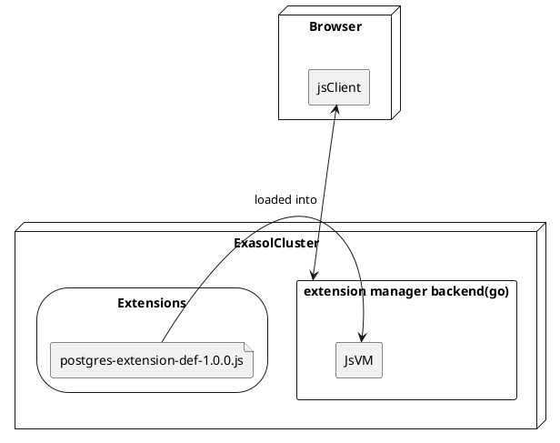

# Design

<!-- 
INFO: This file contains nested plantuml diagrams. For displaying them you need to enable editor support.
For InteliJ see: https://youtrack.jetbrains.com/api/files/74-1236265?sign=MTY1MDg0NDgwMDAwMHwxMS0xfDc0LTEyMzYyNjV8d2VXdWNFVkJfVWZQeV9ZX3JHNF9rYno4cFV2%0D%0AMy1BV2ZSNjZaOUxhdVBOSQ0K%0D%0A&updated=1639999300525
For VS Code: https://marketplace.visualstudio.com/items?itemName=jebbs.plantuml
-->

## Overall Architecture

The extension installer is split into a backend (running in the database) and a client (running in the Saas ui).



### Do we need a backend?

One option would be to implement everything in the JS client. However, we discarded that option, since it does not allow
us upgrade the installed adapters automatically.

### Extensions

The extension manager has an extension mechanism.
The extension manager itself has no dependencies to the virtual schema projects.
They are loaded at runtime.

```plantuml	
postgres as [PostgreSQL Virtual Schema\nExtension definition]
mysql as [MySQL Virtual Schema\nExtension definition]
extensionInterface as [Extension manger interface]

extensionInterface <-- [Extension manager]
extensionInterface <|-- postgres 
extensionInterface <|-- mysql

[Extension manager] -> postgres: loaded at runtime
[Extension manager] -> mysql: loaded at runtime
```

## Extension API

We have one extension definition per extension (integration project).
All extension definitions implement the same public interface:

```plantuml
interface ExasolExtension{

}

ExasolExtension <-- "postgres-virtual-schema (repo).postgres-extension-definition"
ExasolExtension <-- "mysql-virtual-schema (repo).MySqlExtensionDefinition"
```

### Language

For a language we decided for TypeScript.

Alternative JSON: We decided for a programming language like JS since some extensions have more complex installation
mechanisms. Expressing this by just providing SQL scripts with placeholders quickly reaches its limit.
Especially the function for reading back parameter values can get a bit more complex.

Alternative Lua: We could also use Lua. We decided for JS since:

* JS it more popular --> more developers know it
* JS is used in the frontend. If at some point we change our decision and want to run the installation in the client, we
  don't need to update the installers.

The compiled JavaScript code is evaluated in the backend using a nested JavaScript interpreter.
By that it's isolated and for example can't access resources like disc or network.

### Conditional Parameters

We need to have conditional parameters. For example for the s3-document-files-virtual-schema we need to provide a select
for choosing the source type (AWS S3 / Google Cloud Storage / ...). Depending of the source type we want to show / hide
some parameters. For example the S3 Bucket name.

To solve this, we considered the following options:

* Condition as JS code in a string
  Example: `condition: "parameters.source === \"s3\""`
* Condition as JS callback. For example:
   ```js
  extension = {
    condition: (parameterValues) => parameterValues.source === "s3"
  }
  ```
* Condition represented using structured JSON. For example:
   ```js
  extension = {
    condition: {
     parameter: "source",
     operator: Operators.EQ,
     value: "s3"
    }
  }
  ```

We decided for the third option since it does not require evaluating source code from an HTTP request the client. That
allows us to transfer the parameter definition as simple JSON (in contrast to a JS lib / file).

### Validation

We implement input validation in two stages:

* In the client: Simple validation of each field
  * required fields
  * for text: regex
  * for numbers: min, max
* In the backend:
  * Everything validated in the client (validate again to prevent attacks)
  * Validation of the whole input: Here we can validate more complex constraints that for example involve multiple
    fields

For the validation done by the client we define the constraints declarative in the extension:

```ts
param = {
  id: "",
  name: "",
  type: "string",
  regex: /\d+/ // <-- Validation via regex
}
```

For the more complex validation we define it via a JS callback function. That gives the extension definition the maximum
flexibility.
The validation code is executed in the JS VM in the backend.

```ts
extension = {
  //...
  validate(parameterValues) {
    if (parameterValues["source"] === "s3" && !isValidBucketName(parameterValues["bucket"])) {
      return "Invalid bucket name.";
    }
  }
}
```

We decided against a callback for the client side validation. The main reason was that it would require to load code
into the client at runtime. That would require to run code `eval` on code retrieved from a request. Even so the security
risk of that seems acceptable, we decided against it since it would look suspicious.

## Deployment of the Extension Definitions

During the build (of each virtual-schema project) the extension definitions (written in TypeScript) are compiled to a
single JavaScript file:

```plantuml
file postgres-extension-def.ts{
}

file postgres-extension-def.js{ 
}

"postgres-extension-def.ts" -> "postgres-extension-def.js": compiled during build
```

The built installers are attached to the release:

```
Release assets:
postgresql-vs-2.0.2.jar
postgresql-vs-2.0.2.jar.sha256
postgres-extension-def-2.0.2.js
```

A crawler collects the JARs and extension definitions and copies them to BucketFS:

```plantuml
storage "prostgres-virtual-schema release 2.0.2"{
file installerInRepo as "postgres-extension-def-2.0.2.js"
file jarV2InRepo as "postgresql-vs-2.0.2.jar"
}

storage "prostgres-virtual-schema release 1.0.0"{
file "postgres-extension-def-1.0.0.js"
file jarV1InRepo as "postgresql-vs-1.0.0.jar"
}

node ExasolCluster{
storage BucketFS{
file jarV2InBucketFs as "postgresql-vs-2.0.2.jar"
file jarV1InBucketFS as "postgresql-vs-1.0.0.jar"
}
storage Installers{
file installerInBucketFS as "postgres-extension-def-2.0.2.js"
}
}

installerInRepo --> installerInBucketFS
jarV2InRepo --> jarV2InBucketFs
jarV1InRepo --> jarV1InBucketFS
```

Note that only the latest version of the extension definition is deployed.
That means that the extension definition must be able to uninstall and update all old versions of its extension. That
makes testing
harder but is the only way to have the upgrade path tested.
The alternative to also version the extension definition would lead to
unmaintained and untested code (since the old version would not be tested with newer DB versions).

The extension definition are placed in a storage that's accessible from the extension-manager backend. Access from
inside the
database is not required.

Most virtual schemas (including for example the postgres virtual schema) require an additional third-party JDBC driver.
That driver for now must be copied manually into the BucketFS of all SaaS offerings.

